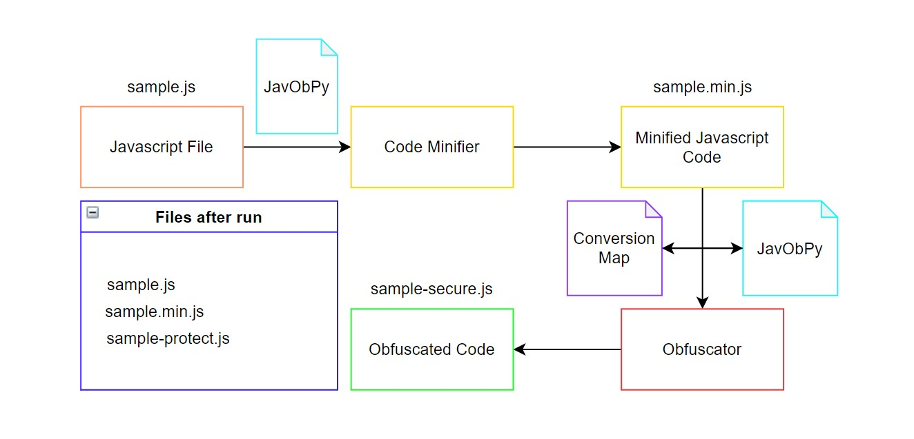

# JavObPy
JavObPy is a superfast javascript (ECMAScript , ES6) **Minifier** and  **Obfuscator** written in Python3 and inspired by JSFuck . This project was built as a subcomponent of the CoProtector ( CoP ) Systems project . TCoP , shall implement a similar algorithm for mimicking JSFuck 4.0 functionality . JavObPy is still under development and changes may be done to the existing source code . 




# Usage
```
C:\file_path> python javobpy.py <javascript_filename>.js
```
JavObPy , is completely system level and hence does not need the use of any additional dependencies or libraries for its functioning .

# What is Minification ?
Minification (also minimisation or minimization) is the process of removing all unnecessary characters from the source code of interpreted programming languages or markup languages without changing its functionality. These unnecessary characters usually include white space characters, new line characters, comments, and sometimes block delimiters, which are used to add readability to the code but are not required for it to execute. Minification reduces the size of the source code, making its transmission over a network (e.g. the Internet) more efficient. In programmer culture, aiming at extremely minified source code is the purpose of recreational code golf competitions.

To learn more about Minification and what it is all about , refer to this [link](https://en.wikipedia.org/wiki/Minification_(programming))

# What is Obfuscation ?
Obfuscation is the obscuring of the intended meaning of communication by making the message difficult to understand, usually with confusing and ambiguous language. The obfuscation might be either unintentional or intentional (although intent usually is connoted), and is accomplished with circumlocution (talking around the subject), the use of jargon (technical language of a profession), and the use of an argot (ingroup language) of limited communicative value to outsiders.

To learn more about Obfuscation and what it is all about , refer to this [link](https://en.wikipedia.org/wiki/Obfuscation)

##
:copyright: [Ansh Sarkar a.k.a SeraphimCoder](https://github.com/Ansh-Sarkar)

